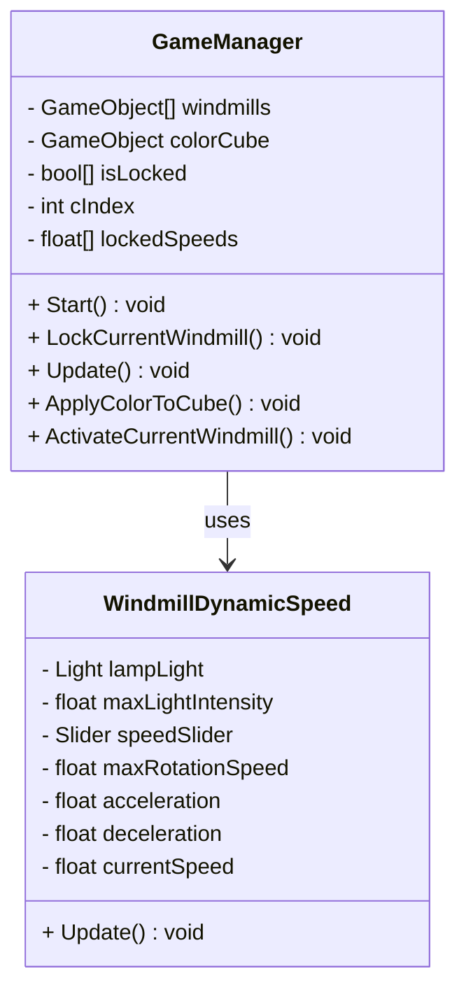

# 16-Windmills-SPAV
Die Windmühlen drehen sich jetzt einzeln, und die Buttons zum Locken funktionieren. Nach dem Locken dreht sich die nächste Windmühle. Am Ende werden alle Slider-Werte genommen und der Hintergrund wird gefärbt. Den Fehler habe ich jetzt behoben.

## Was funktioniert jetzt:
- **Einzeldrehung der Windmühlen:**
  - Alle Windmühlen drehen sich **jetzt einzeln** und nicht mehr gleichzeitig.
- **Buttons zum Locken:**
  - **Die Buttons funktionieren**, um **jede Windmühle einzeln zu locken**.
  - **Sobald eine Windmühle gelocked** ist, **dreht sich die nächste**.
- **Farbänderung des Hintergrunds:**
  - **Wenn alle Windmühlen gelocked** sind, werden die **Slider-Werte genommen**.
  - **RGB-Werte** werden **kombiniert** und damit **der Hintergrund gefärbt**.
- **Keine Arrays mehr für Slider:**
  - **Die Slider sind nicht mehr als Array** festgelegt.
  - **Jeder Slider** wird **direkt aus der Windmühle** geholt, ohne dass man ihn **vorher im Array** festlegen muss.

---

## Was noch fehlt:
- **Dynamische Erkennung der Windmühlen:**
  - **Im Moment** benutze ich noch ein **`windmills[]`-Array**.
  - **Ziel**: Dass **alle Windmühlen automatisch** erkannt werden, **egal wie viele** ich in die Szene setze.
  - Dann müsste man **das Array nicht mehr manuell anpassen**.

https://github.com/user-attachments/assets/164dc7e3-92c9-443c-81cd-8d4722df80eb

